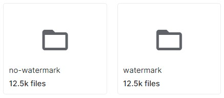
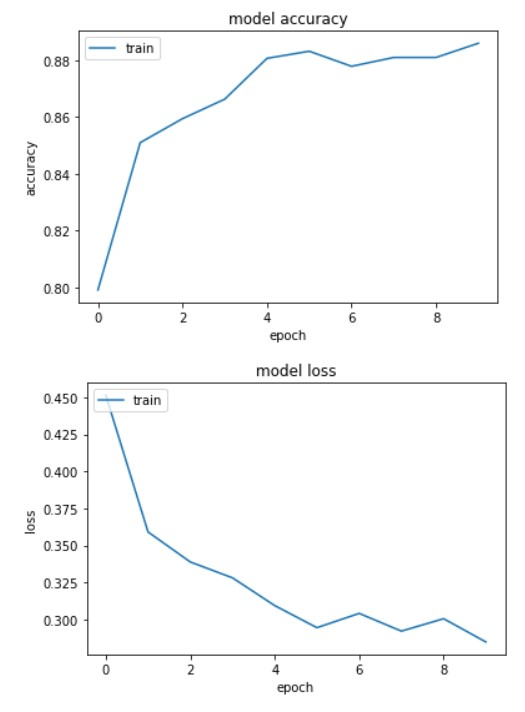

# Watermark-Detection-using-InseptionResnetV2-
This algorithm detect watermark on images it may be in the form of text or signature. The InceptionResnetV2 is used for detection purpose achieving a great testing accuracy. The following model is used for many purposes like housing websites etc. 

## Dataset
https://www.kaggle.com/datasets/felicepollano/watermarked-not-watermarked-images

Datset set contain two folders watermark images and no watermark images, both folders have 25k images. 

## Methodology
InceptionResnetV2 is used  
Epoch size = 100 /t
Epochs = 10 /t
Using the following the training accuracy of the model is 88.59% as well as the testing accuracy is 88.54%.

